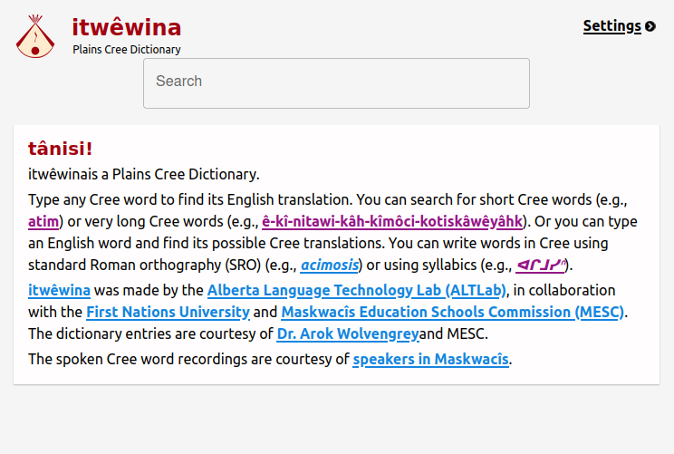
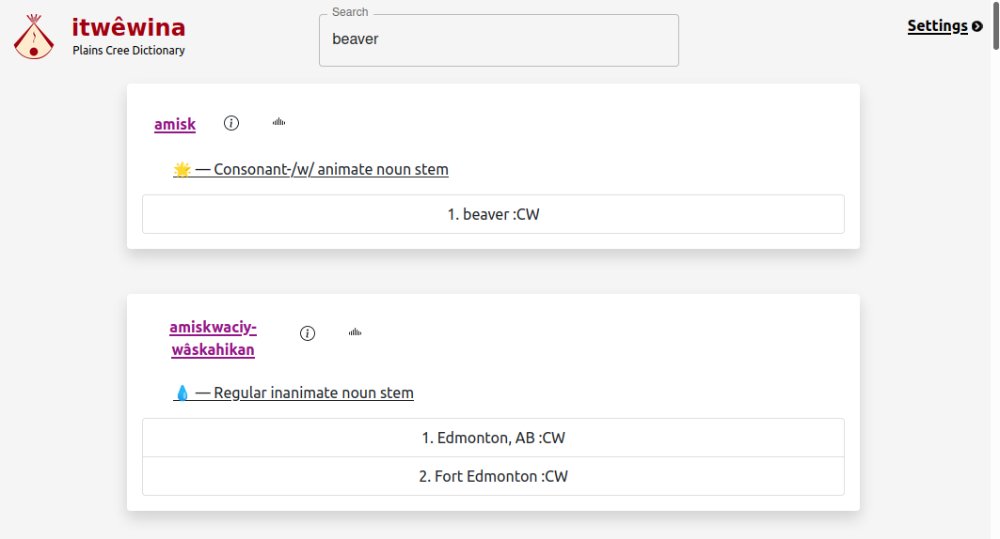
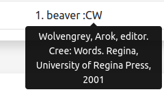
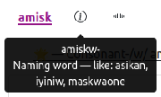
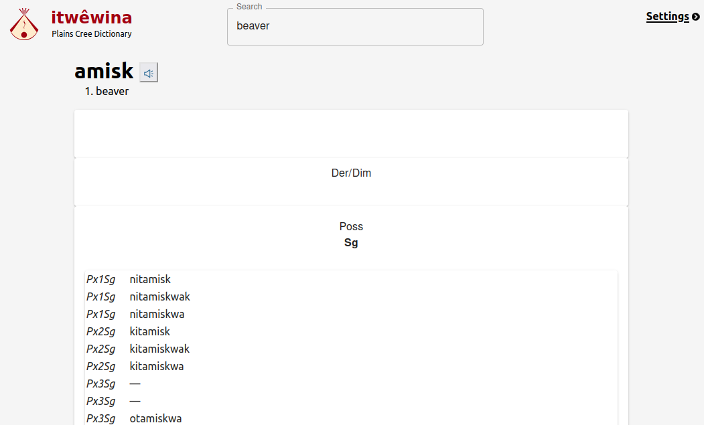
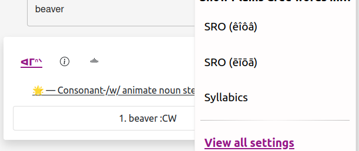
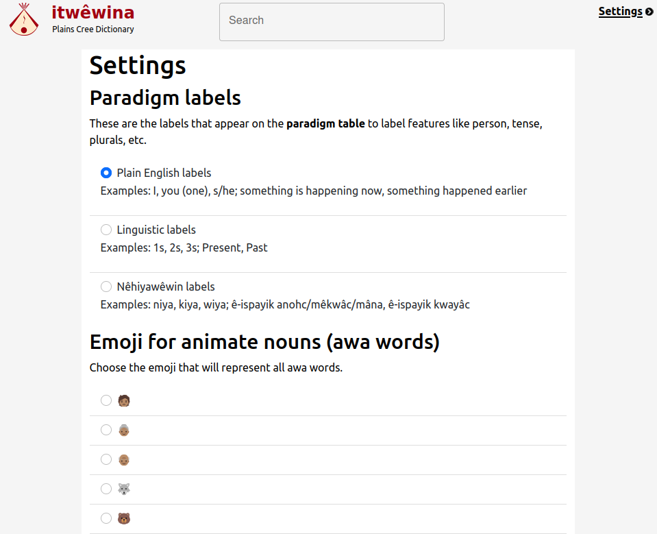

## End-user documentation

### Home screen

Home screen provides a welcome information to the user, and a quick guide on how to operate the website.



Tools like logo, search, and settings are always available in the top bar. Logo provides a unique design element that connects as a reference to the Cree roots of the project, and serves as a home button that brings users back to the home screen whenever clicked. Search allows users to initiate a search for a desired word and choose the best option. Settings takes the user to a different screen that allows customizing search results and visual representation

### Search screen

Search screen main function is to provide functionality to search for different words and meanings, and to provide concise information related to choosing the best translation.



To search for a word, simply enter the word or parts of it into the search bar. The search allows searching by a word's lemma, derived wordforms, and translations. In the example above, amisk is the translation from the searched word beaver. Search results also provide linguistic information about a word.
The lower most part of a result card shows different possible translation of the word, as well as a dictionary that served for this translation.



When hovering over a definition, a tooltip will appear to describe the dictionary.



Information icon provides more details about the word, and copies the details to the user's buffer for easier reuse functionality.

### Word Screen

This page provides the paradigm for the word.



The cards below provide different wordforms based on their connections to time. The cards can be expanded and closed to arrange the wordforms as the user pleases. It furthermore provides partially implemented speaker function that produces word audio spoken by a original language speaker.

### Settings Fonts

The dropdown under the settings button allows user to choose translation representation between using circumflex, macron, and syllabics. An example of using syllabics is shown below.



### Full-size Settings

To navigate to more website settings click on "View all settings" under font settings.



Here the user is able to choose label types that are displayed on the paradigm, select an emoji to accompany noun verbs, choose dictionary to use in a search, and a optional audio exhibition. Settings related to audio are currently being developed by ALTLab and not implemented in this project.

## Deployment Manual

### Test Webserver Security Curtin

First we need to set `screen` so cybera doesn't kill the process when we exit the server.

`screen -S internet_facing`

Second things second we use fast api to run the test development server. This means that we need to install it:

`pip install "uvicorn[standard]"`

Next things next we need to make a run file that will talk to the `localhost` i.e the backend that should **never** be exposed to the internet without filtering. This means to do the following:

`mkdir internet_facing`

`cp -r main.py .../internet_facing`

Assuming fast api and uvicorn are installed together run the following command.

`uvicorn main:app --port 8081`

Assuming everything ran without issues do the following:

`ctrl-a d`

### Deployment

Follow these steps exactly as failure to this will cause the system to not render properly.

#### Website

1. `git clone {our repo}`
2. `cd morphodict`
3. `rm package-lock.json`
4. `npm i`
5. `npm run build`
6. `cd build`
7. `pwd`
8. Copy the results from 7

After running this the website should build correctly.

#### Server

1. `sudo apt-get install nginx`
2. `cd etc/nginx/sites-available/`
3. `sudo nano morph_deploy.nginx`
4. Paste the following:

```json
{

    server {

            listen 80;

            root {#8 pasted from above};
            index index.html;

            location / {
            try_files $uri /index.html;
            }

            location /local/ {
            proxy_set_header Host $http_host;
            proxy_set_header X-Forwarded-For $proxy_add_x_forwarded_for;
            proxy_set_header X-Forwarded-Proto $scheme;
            proxy_set_header Upgrade $http_upgrade;
            proxy_redirect off;
            proxy_buffering off;
            proxy_pass http://127.0.0.1:8081;
            }
    }

    server {

        listen [::]:80;

        root {#8 pasted from above};;
        index index.html;

        location / {
            try_files $uri /index.html;
        }

        location /local/ {
        proxy_set_header Host $http_host;
        proxy_set_header X-Forwarded-For $proxy_add_x_forwarded_for;
        proxy_set_header X-Forwarded-Proto $scheme;
        proxy_set_header Upgrade $http_upgrade;
        proxy_redirect off;
        proxy_buffering off;
        proxy_pass http://[::1]:8081;
        }

    }

}
```

5. `sudo ln -s /etc/nginx/sites-available/morph_deploy.nginx /etc/nginx/sites-enabled/morph_deploy.nginx`

6. `sudo nginx -T` Confirm no errors are encountered
7. `sudo systemctl reload nginx`

From here you should be done, now time to launch the database!

### Backend REST API

Please follow along from here: [https://morphodict.readthedocs.io/en/latest/](https://morphodict.readthedocs.io/en/latest/)
