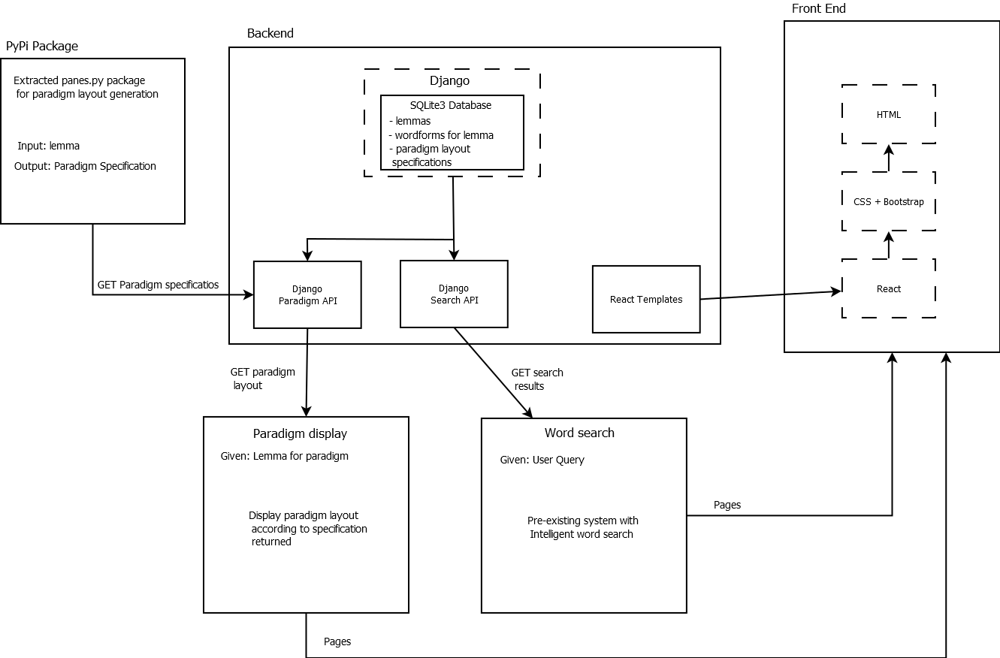
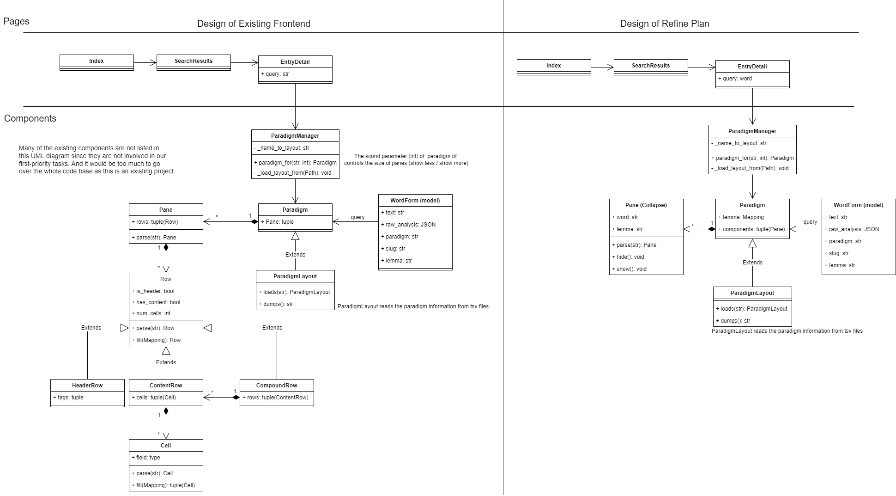
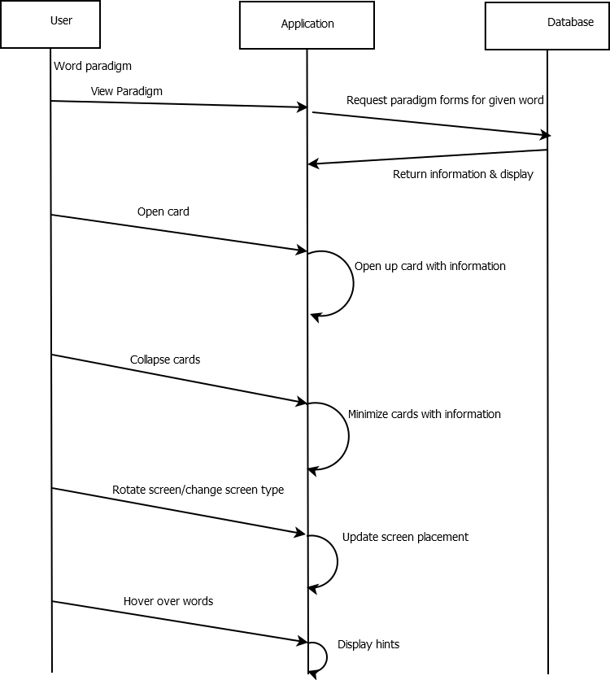
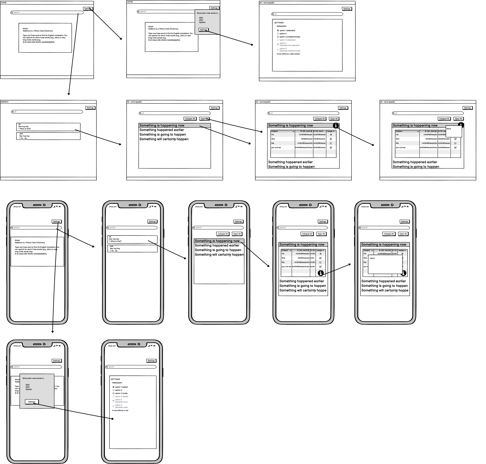

# Software Design

Below are some diagrams referring to the overall structure and functional design of the system and rework tasks.

 

## Architecture Diagram

The architecture diagram provides an overview of the revised system, with the interconnections and requests between different parts, as well as displaying extracted panes package and its relation.

 

## UML Diagram

UML diagram shows basic components and structures that are related to our refactoring tasks. Paradigm pane is the main structure that may contain multiple rows, that are to be embedded on screen.

 

## Sequence Diagram

Sequence diagram describes basic interaction between the user and paradigm panes, as it's the only interactive element in the rework.

 

## Low-Fidelity User Interface

User Interface diagram shows low-fidelity design of the paradigm layout page on desktop and mobile and some actions of collapsing, viewing, and setting wordforms.

 
