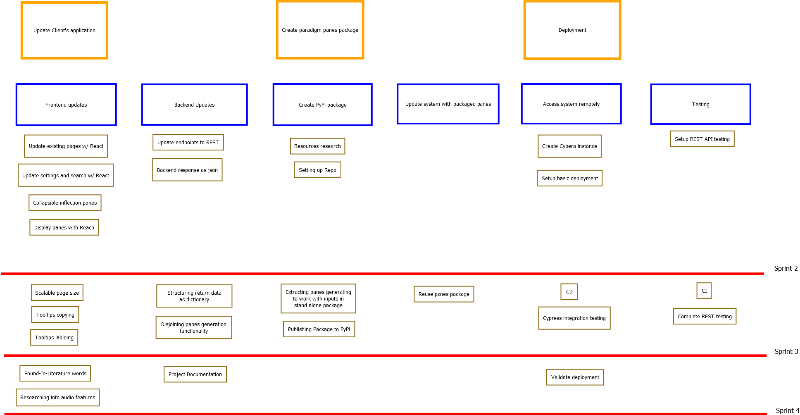

# Project Management

This page is an overview of the tasks and roles assigned to team members over the course of the project. Assignments and deadlines are subject to change.

 

## Story Map

 

## Project Plan

### Sprint 1:

| **Rubric Description**    | **Task To-Do** | **Assigned To** | \*\*Date To Complete By |
| ------------------------- | -------------- | --------------- | ----------------------- |
| Requirement Specification | Documentation  | Fred            | January 26th            |
| UI Diagram                | Documentation  | Batu            | January 21st            |
| Sequence Diagram          | Documentation  | Vova            | January 25th            |
| UML Diagram               | Documentation  | Zijie           | January 26th            |
| Release Planning          | Documentation  | Everyone        | January 28th            |

### Sprint 2:

| **Rubric Description**                  | **Task To-Do** | **Assigned To** | \*\*Date To Complete By |
| --------------------------------------- | -------------- | --------------- | ----------------------- |
| Make Existing Pages use React           | 1.01           | Zijie           | Feb 16th                |
| Update Settings and Search to use React | 1.02           | Fred            | Feb 22th                |
| Display Paradigm Panes with React       | 1.03           | Fred, Zijie     | Feb 25th                |
| Collapsible Cards for Tense Inflections | 1.06           | Zijie           | Feb 17th                |
| REST API URI                            | 2.01           | Batu, James     | Feb 25th                |
| JSON Responses                          | 2.02           | Batu, James     | Feb 25th                |
| Cybera Instance                         | 5.01           | Vova            | Feb 20th                |
| Project Deployed                        | 5.02           | Vova            | Feb 26th                |
| Revise Requirements from Sprint 1       | Documentation  | Vova            | Feb 26th                |
| Initiate REST Testing                   | Testing        | Batu, James     | Feb 26th                |

### Sprint 3:

| **Rubric Description**                           | **Task To-Do** | **Assigned To**   | \*\*Date To Complete By |
| ------------------------------------------------ | -------------- | ----------------- | ----------------------- |
| Scalable Page Size                               | 1.04           | Fred, Zijie       | March 15th              |
| Research ToolTips to provide extra functionality | 1.07, 1.10     | Fred              | March 18th              |
| Return data structured as dictionary             | 2.03           | Batu, James       | March 5th               |
| Ensure panes.py are independent from the system  | 3.01           | Vova              | March 8th               |
| Publish panes.py to PyPi                         | 3.02           | Vova              | March 12th              |
| Reuse package in the project                     | 3.03           | Batu, James, Vova | March 18th              |
| Complete most REST API tests                     | 4.01           | Batu, James       | March 13th              |
| Reuse existing integration testing for frontend  | 4.02           | Fred, Zijie       | March 13th              |
| Setup CI/CD                                      | 4.03           | Zijie             | March 13th              |

### Sprint 4:

| **Rubric Description**                | **Task To-Do** | **Assigned To** | \*\*Date To Complete By |
| ------------------------------------- | -------------- | --------------- | ----------------------- |
| Distinguish Found-In-Literature words | 1.05           | Fred, Vova      | April 1st               |
| Test Deployment                       | Validate       | Zijie           | April 1st               |
| User Manual                           | Documetation   | James           | April 1st               |
| Acceptance Tests                      | Documetation   | Batu            | April 1st               |
| Deployment Manual                     | Documetation   | Zijie           | April 1st               |
| Project Presentation                  | Documetation   | Everyone        | March 29th              |

 

## Team Canvas

> #### Project GOALS

> 1. To help the client achieve their goals!
> 2. To uphold the goals and views of the First Nations Communities.
>    a. Restoring their language
> 3. Build a phone friendly website.

> #### TEAM GOALS

> 1. Work in a new environment.
> 2. Learn advanced web technologies.
> 3. Learn to deal with pre-existing code base.
> 4. Improve our adaptability to dependent and spread-out code.

 

## Roles && Skills

#### Scrum Master:

> Everyone is planning to try the role of Scrum Master. Rotation per sprint is as follows.
>
> 1. Fadi Bonilla
> 2. Batu/ Cenab Batu Bora
> 3. Vova / Uladzimir Bondarau
> 4. Zijie Tan
> 5. James Schaefer-Pham

#### Roles:

> - Front-end Developers
> - Back-end Developers
> - Packaging to PyPi

> **We plan to work on different part of the projects throughout the length of the term, but major responsibilities are:**

> - Fadi/Fred Bonilla (Project Owner) - **Front End**

> - Zijie Tan - **Front End**

> - Batu / Cenab Batu Bora - **Back End**

> - James Schaefer-Pham - **Back End**

> - Vova / Uladzimir Bondarau - **Packaging**

 

## Purpose

> 1.  Add tools to make sure First Nations Languages are not forgotten.
> 2.  Get experience building advanced and modern front end system.
> 3.  Get experience building REST API.
> 4.  Deploy a project in Production and implement CI/CD.
> 5.  Obtain class credits.

 

## Values

> To do things as fast and as well as we can make them.  
> We want to be reliable and add value to our clients and community.

 

## Rules & Activities

> To be honest and respectful of our colleagues by maintaining our S.C.R.U.M. practices.

