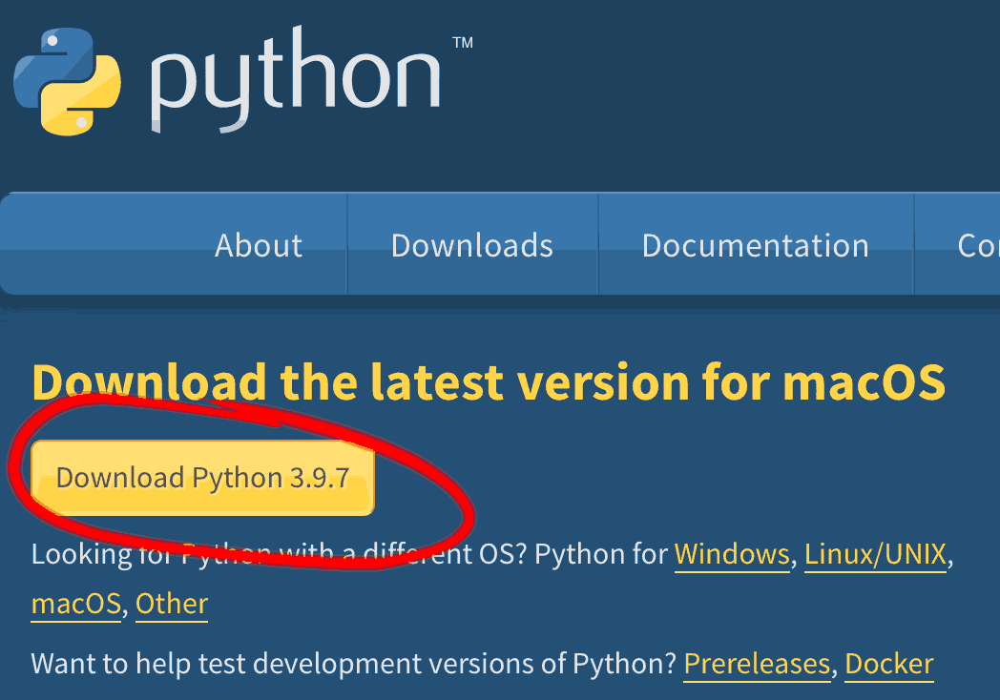

Developer’s Guide
=================

Use this guide to work on the **Cree Intelligent Dictionary** repo.

After you follow the steps below to get set up, this typically becomes as
easy as running

    pipenv shell

and then, inside that shell, running

    foreman start

But the first time you try to do that, it will take a bit of work to get
set up. If you have trouble, please contact us and/or file issues so that
we can improve the process and/or this documentation.

Installing for the first time
-----------------------------

Clone the repo and `cd` into it, as usual.

    git clone https://github.com/UAlbertaALTLab/morphodict.git
    cd morphodict

And then, to pull some large data files not stored directly in the GitHub
repository, run:

    git lfs install --local && git lfs fetch && git lfs checkout

If this fails, you can have [homebrew](https://brew.sh) install Git LFS
with `brew install git-lfs`.

### Install Python

Get Python 3.9 and [Pipenv](https://github.com/pypa/pipenv#installation).

Within the directory, install all Python dependencies:

    pipenv install --dev

If you run into trouble, the following notes may help:

  - On Ubuntu 20.04, if pipenv can’t find Python 3.9 and complains about
    there being `no module named distutils.command`, do `apt install -y
    python3-distutils`

  - On Ubuntu, if you get an error running pipenv that says `"Python.h" not
    found`, install the `python3.9-dev` package

  - On macOS, the official version of Python distributed by python.org is
    more likely to work successfully than anything from homebrew or
    elsewhere.

    Go to <https://www.python.org/downloads/> on your mac and click the
    yellow, easy-to-overlook button to “Download Python 3.9.x” (any 3.9.x
    version is fine) underneath the “Download the latest version for macOS”
    heading.

    

  - On macOS, if the `pipenv` command is not found, you can try:

        python3.9 -m ensurepip --user --upgrade
        python3.9 -m pip install --user --upgrade pipenv

    and then run `python3.9 -m pipenv install --dev`. Running `python3.9 -m
    pipenv` does the same thing as running `pipenv` is supposed to, but is
    more likely to work if you have multiple versions of Python and/or
    pipenv installed, or if you haven’t adjusted your shell’s `PATH`.

  - On macOS, once in the pipenv shell, you can check exactly which python
    you are using by running

        ls -l $(which python)

    If it is not
    `/Library/Frameworks/Python.framework/Versions/3.9/bin/python3.9`,
    you can make it be that with

        pipenv install --dev \
            --python=/Library/Frameworks/Python.framework/Versions/3.9/bin/python3.9

### Install NodeJS

Install [NodeJS][] version 10 or greater.

[NodeJS]: https://nodejs.org/

With Node installed, install all of the JavaScript dependencies using `npm`:

    npm install

### Environment

Create a file named `.env` in the project root using the following
template:

```sh
# .env
DEBUG=true
USE_TEST_DB=true
DEBUG_PARADIGM_TABLES=true

# This next line prevents `git push` from hanging if you do not have SSH access
# to our Git Large File Storage server. Such access is only needed if you want
# to commit changes to large binary files such as FSTs and vector models.
GIT_LFS_SKIP_PUSH=1
```

These are environment variables that affect whether Django is in debug mode
and whether Django should use a smaller test database.

The environment variables go into effect when using `pipenv shell`, or by
running a program with `pipenv run`. However, `pytest` is configured to
always `USE_TEST_DB`, regardless of the `.env` file contents.

### The development environment

Run `pipenv shell` so that all of the Python dependencies work:

    pipenv shell

### Run the bootstrap script

Running

    ./scripts/dev-bootstrap

creates the test databases for all supported languages.

### Full database

Where to get full dictionaries is described in [Current dictionary
data](current_dictionary_data).

### Importing dictionaries

Once you have a full dictionary, import it into the database:

    ./${sssttt}-manage importjsondict [file]

There are three flags to know about for the `importjsondict` command:
`--purge`, `--incremental`, and `--atomic`. They are described in the
`--help` output. The default values depend on the specific language pair
whether `DEBUG` is set; check the `--help` output to see what the defaults
for your situation are.

On a newish laptop or desktop, importing the full Plains Create dictionary
should take roughly 5-10 minutes.

In production, the import time for the Plains Cree dictionary is roughly:

  - 20 minutes to import into a brand-new database, with much of that time
    being spent creating auto-translations.

  - Nearly instantaneous to update up to a few hundred entries, when used
    with `--incremental`, plus at most a few tens of seconds of write out a
    new definition vector file.

  - One hour to update every single single entry, which is the default
    when `--incremental` is not used, and which is required when you have
    added entirely new paradigm fields or have updated the generator FST or
    the phrase translation FSTs.

    This could be greatly sped up by using solid-state drives, and/or
    batching deletes in the importjsondict command.

(dictionaries-in-production)=
#### In production

The following could all conceivably be automated.

  - In production, the `~morphodict/src/sssttt/resources/dictionary` folder
    is mounted into the docker container at
    `/app/src/sssttt/resources/dictionary`.

  - If the file `sssttt_dictionary.importjson` is placed into that folder,
    possibly after being obtained from the git repo at `/data/altlab.git`,
    then `importjsondict` will automatically use it.

  - To update a production database, run `importjsondict` inside the
    container:

        ~morphodict/morphodict/docker/helper.py manage sssttt importjsondict --purge [PATH_TO_FILE_IN_CONTAINER]

  - It is strongly recommended to restart the container after updating the
    dictionary.

        cd ~morphodict/morphodict/docker && docker-compose restart sssttt


### Compile JavaScript and CSS

Our JavaScript and CSS must be built before being used. Run this
command:

    npm run build

(note: using foreman automatically runs the underlying command in watch
mode)


Running the development server
------------------------------

Install foreman with `gem install --user foreman`.

Then run `foreman start` to run the Django servers for all languages, as
well as the Rollup watch process.

Then you can access the dictionary applications at various port numbers:

 - itwêwina: <http://127.0.0.1:8000/>
 - arpeng: <http://127.0.0.1:8007/>
 - cwdeng: <http://127.0.0.1:8005/>
 - srseng: <http://127.0.0.1:8009/>

Because [cookies are not port-specific for historical insecurity
reasons](https://stackoverflow.com/questions/1612177/are-http-cookies-port-specific),
you can only be logged in to one `127.0.0.1` development site at a time. If
that becomes problematic, give each development site a unique hostname by
adding the following to `/etc/hosts`:

    127.0.0.1 arpeng-local
    127.0.0.1 cwdeng-local
    127.0.0.1 crkeng-local
    127.0.0.1 srseng-local

Then you can access the sites with cookie isolation at
<http://crkeng-local:8000/>, <http://cwdeng-local:8005/>,
<http://arpeng-local:8007/>, and so on.

If you only want to run one dictionary, you can locally comment out lines
in the Procfile.


Contributing
------------

Once you have committed some changes with git, you can send a pull request
via GitHub. The repo is public, so you do not need any special permissions
or access to the main repository in order to send pull requests.

Create a ‘fork’, commit your changes to it, and then send a ‘pull request’
which requests that the morphodict maintainers ‘pull’ your changes into the
main repository.

**Note**: *If you get odd problems with `git push` seeming to hang*, even
when pushing to your own fork, you may be running into a firewall issue
with Git LFS. There are two things you can try to fix that:

   - Run `GIT_LFS_SKIP_PUSH=1 git push` instead of `git push` by itself

   - Make sure `GIT_LFS_SKIP_PUSH=1` is in your `.env` file and run `git push`
     from inside the pipenv shell

   - Comment out the `pushUrl` line in the `.lfsconfig` file in your local
     checkout of the repository

Explanation: We use Git Large File Storage to manage some large files, such as
already-built FSTs, outside the typical git storage mechanism. Updates to these
files can be pulled by anyone over https, but pushing them requires ssh access
to our server. You only need this ssh access if you are updating these files,
and without setting up this access in advance, git’s attempt to use ssh is
likely to hang while trying to log in to our server directly from the public
internet.


Where are the JavaScript files?
-------------------------------

They're located in `frontend/`. They're compiled by [Rollup][] to the
appropriate static directory. Note that Rollup allows you to `import` or
`require()` npm modules in to the frontend JavaScript code; use this
power wisely!

Rollup also minifies the JavaScript when `DEBUG=False`.


Where are the CSS files?
-------------------------------

They're located in `frontend/css`.  They're compiled by [Rollup][] to the
appropriate static directory. We're using [PostCSS][] to inline
any `@import`'d CSS, and to provide a fallback for
[CSS custom properties](https://developer.mozilla.org/en-US/docs/Web/CSS/--*) (a.k.a., CSS Variables).

Rollup/PostCSS also minifies the CSS when `DEBUG=False`.


Unit Tests
----------

    pipenv run test

It recognizes the following:

 - The Django settings module in `setup.cfg` (for `pytest-django` to work)
 - `--doctest-modules` `--mypy` in `Pipfile [script]` (to enable doctest and Mypy tests)
 - `DEBUG=False` `USE_TEST_DB=True` in `.env`


Cypress integration tests
-------------------------

    npm test

Or, for interactive use:

    npx cypress open

> **Eddie “sez”**: My workflow is to have three terminals open:
>
> 1. Vim (editing files)
> 2. `npm start` — start the development server
> 3. `npx cypress open` — start Cypress interactively 
>

Profiling Code
--------------

We use [django-toolbar-toolbar](https://django-debug-toolbar.readthedocs.io/en/latest/). 
It provides great UI for stack tracing and SQL query profiling.


Format Python code
------------------

We format all Python code with [Black](https://black.readthedocs.io/en/stable/)

To run it on all of the files:

    pipenv run format

> **Protip**! Make this a part of your git pre-commit hook!

Optional: Install HFST
----------------------

You don’t need this to run the dictionary, but having these tools installed
can be useful if you are building, modifying, or directly interacting with
FSTs.

On Mac:

>     brew install UAlbertaALTLab/hfst/hfst

On Windows:

> Download [hfst-latest.zip](https://apertium.projectjj.com/win32/nightly/)
> and unpack it. Add the `hfst/bin` folder to your system path.

On Linux:

>     sudo apt-get install -y hfst

For help, see [HFSTOL installation guide](https://github.com/hfst/hfst#installation-packages-for-debian-and-ubuntu).


<!-- links -->

[Rollup]: https://rollupjs.org/guide/en/
[PostCSS]: https://postcss.org/
