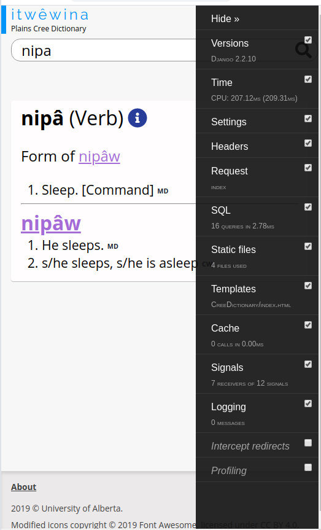

Developer’s Guide
=================

Use this guide to work on the **Cree Intelligent Dictionary** repo.


Installing for the first time
-----------------------------

Clone the repo and `cd` into it, as usual.

    git clone https://github.com/UAlbertaALTLab/cree-intelligent-dictionary.git
    cd cree-intelligent-dictionary

### Install Python

Get Python 3.6 and [Pipenv](https://github.com/pypa/pipenv#installation).

Within the directory, install all Python dependencies:

    pipenv install --dev

### Install NodeJS

Install [NodeJS][] version 10 or greater.

[NodeJS]: https://nodejs.org/

With Node installed, install all of the JavaScript dependencies using `npm`:

    npm install

### Install HFST

Make sure `hfst-optimized-lookup` is installed.

On Mac:

>     brew install UAlbertaALTLab/hfst/hfst

On Windows:

> Download hfstol binary file. Add bin folder to system path.

On Linux:

>     sudo apt-get install -y hfst

For help, see [HFSTOL installation guide](https://github.com/hfst/hfst#installation-packages-for-debian-and-ubuntu).


### XML Dictionary Files

Download `crkeng.xml` and `engcrk.xml` and place them under `CreeDictionary/res/dictionaries/`

These files are copyright protected and not allowed on GitHub. Ask coworkers or download from production server under the same directory. On Sapir, the directory is `/opt/cree-intelligent-dictionary/CreeDictionary/res/dictionaries/`

### Environment

Create a file named `.env` in the project root using the following
template:

```sh
# .env
DEBUG=true
USE_TEST_DB=true
```

These are environment variables that affect whether Django is in debug
mode, whether Django should use `./CreeDictionary/test_db.sqlite3`
instead of the production database, and whether the JavaScript should be
minified.

The enviroment variables go into effect when using `pipenv shell`, or by
running a program with `pipenv run`.


### The development environment

Run `pipenv shell` so that all of the Python dependencies work:

    pipenv shell

### Initialize Database

As with any Django app, you must create and apply all migrations.

    pipenv run make-migrations && pipenv run migrate

### Build Database

> Note: if you have `USE_TEST_DB=true`, you can skip this step

Now import the dictionaries into the database:

    manage-db import CreeDictionary/res/dictionaries/

It takes several minutes to process the XML file and write into the
database. For better performance, enable multi-processing with
`PROCESS_COUNT` being at most your CPU core count:

    manage-db import CreeDictionary/res/dictionaries/ --muti-processing PROCESS_COUNT

### Create an admin account (optional)

To use the Django admin interface, you need to make yourself an admin
account:

    python ./CreeDictionary/manage.py createsuperuser


Running the development server
------------------------------

    npm start

This starts both the Django server, and the Rollup watch process.

 - Homepage: <http://127.0.0.1:8000/>
 - Admin: <http://127.0.0.1:8000/admin>


Where are the JavaScript files?
-------------------------------

They're located in `src/`. They're compiled by [Rollup][] to the
appropriate static directory. Note that Rollup allows you to `import` or
`require()` npm modules in to the frontend JavaScript code; use this
power wisely!

Rollup also minifies the JavaScript when `DEBUG=False`.


Where are the CSS files?
-------------------------------

They're located in `src/css`.  They're compiled by [Rollup][] to the
appropriate static directory. We're using [PostCSS][] to inline
any `@import`'d CSS, and to provide a fallback for
[CSS custom properties](https://developer.mozilla.org/en-US/docs/Web/CSS/--*) (a.k.a., CSS Variables).

Rollup/PostCSS also minifies the CSS when `DEBUG=False`.


Unit Tests
----------

    pipenv run test

It recognizes the following:

 - The Django settings module in `setup.cfg` (for `pytest-django` to work)
 - `--doctest-modules` `--mypy` in `Pipfile [script]` (to enable doctest and Mypy tests)
 - `DEBUG=False` `USE_TEST_DB=True` in `.env`


Cypress integration tests
-------------------------

    npm test

Or, for interactive use:

    npx cypress open


Profiling Code
--------------

We use [django-toolbar-toolbar](https://django-debug-toolbar.readthedocs.io/en/latest/). 
It provides great UI for stack tracing and SQL query profiling.




Format Python code
------------------

We format all Python code with [Black](https://black.readthedocs.io/en/stable/)

To run it on all of the files:

    pipenv run format

> **Protip**! Make this a part of your git pre-commit hook!


<!-- links -->

[Rollup]: https://rollupjs.org/guide/en/
[PostCSS]: https://postcss.org/
