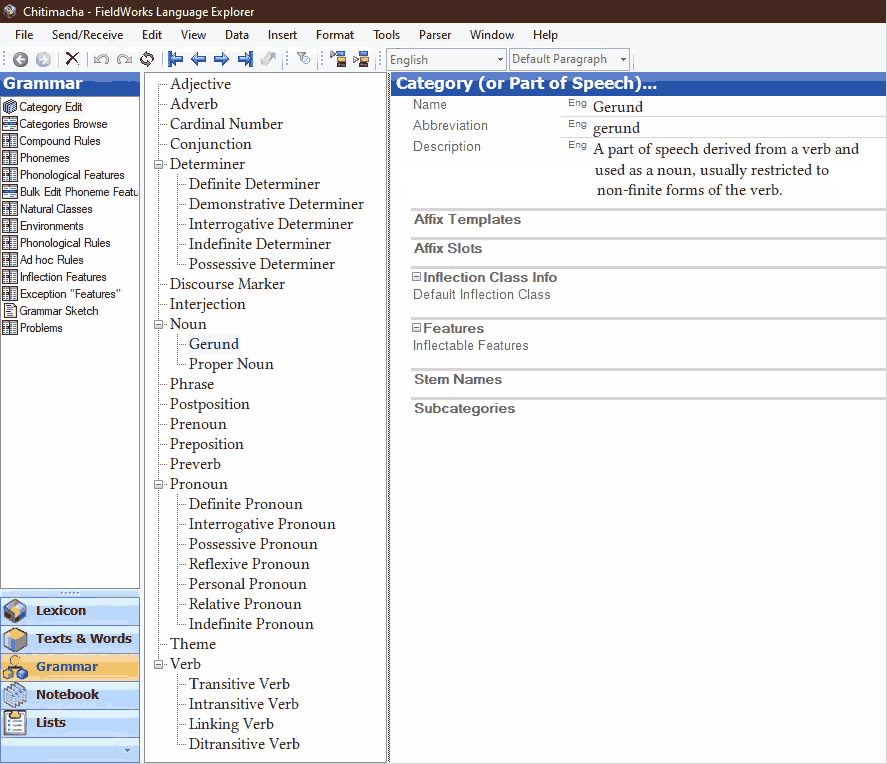

# Summary

To get a working dictionary application, you’ll need linguistic data for
the morphodict code to use.

_**Note**: `sssttt` below refers to a [language pair abbreviation](sssttt)._

The *minimum* linguistic data you’ll need to get started on a dictionary
is the following:

  - The three-letter [ISO 639-3 language
    codes](https://iso639-3.sil.org/code_tables/639/data) for the source
    and target languages.

  - The definition of a single word.

  - A paradigm table for that word. This could be as simple as a photocopy
    of a page from a textbook showing each wordform, annotated with the
    desired FST analysis for each.

  - It’s nice to know the endonym aka autonym aka the name of the language
    in the language itself; but `sssttt` can always be used as a
    placeholder at the start.

With that, you or a developer can create a very basic FST that only handles
a single lemma, and create starter versions of the files described below in
their correct formats. With that, you can have a dictionary up running, and
start iterating on the content from there.

The `./crkeng-manage newdictsite` command should create the basic structure
of the new dictionary.

The specific kinds of required linguistic data are:

  - [A dictionary in importjson format](dictionary_data)

    Usually you will have or create the canonical dictionary data in some
    other format, and will write some code to extract and convert the
    required data from the canonical dictionary source to [the
    morphodict-specific importjson format](importjson-spec)

    The dictionary data is placed in `src/${sssttt}/resources/dictionary`;
    and loaded into the database via the `${sssttt}-manage importjsondict`
    command.

    Typically, there are two importjson files for each language:

      - a full dictionary which is *not checked in on github* because
        dictionaries tend not to be publicly redistributable,
      - and a small test dictionary [extracted from the full
        dictionary](building_test_dictionary_data), which is checked in for
        development and testing purposes.

  - Analyzer and generator FSTs in [hfstol format]

    These go in the `src/${sssttt}/resources/fst` directory,
    with the exact files configured in `settings.py`.

    A spell-relaxed analyzer FST is also strongly recommended, but if you
    do not have one, just re-use the one analyzer FST that you do have.

    We have first-class support for FSTs built in the
    [GiellaLT](https://giellalt.uit.no/) infrastructure, though other FSTs
    have also been used.

  - [Paradigm layout files](paradigm_layouts)

    These generally go in `src/${sssttt}/resources/layouts`; see [Where to
    place paradigm layout files](where_paradigm_files_go) for more
    specifics.

    If you are editing these be sure to set a
    [`DEBUG_PARADIGM_TABLES=True`](DEBUG_PARADIGM_TABLES) environment
    variable so you don’t have restart the python server to see updates.

  - Relabellings

    FSTs have tags that only linguists know the meaning of, and often these
    tags are abbreviated in ways that only the person who made that
    particular FST fully understands.

    Relabellings map FST tags to various classes of human-understandable
    labels.

    They also confusingly map Cree word class names and give definitions
    for preverbs sometimes too, but we need to do something different and
    better for other languages.
    
    The relabelling file is located at `sssttt/resources/altlabel.tsv`. This file is 
    language specific.

    For example, the Plains Cree FST tag `+1Sg` can be mapped to:

      - Linguistic short: “1s”

        Appears inside paradigm tables when “linguistic labels” are
        selected

      - Linguistic long: “Actor: 1st Person Singular”

        For an FST tag, it’s not clear where this is actually used; for a
        Cree word class name, this can appear in search results, or at the
        top of a word detail page

      - English: “I”

        Appears inside linguistic info popup on search results,
        and in paradigm tables when “English labels” are selected

      - nêhiyawêwin: “niya”

        Appears inside paradigm tables

      - Emoji: not applicable for `+1Sg`, but for a different example,
        `+N+A` maps to “🧑🏽”

        Appears in search results, or at the top of a word detail page

    In addition to mappings for individual FST tags, the relabelling files
    allow specifying labels for *combinations* of tags, so that `+1Sg+2SgO`
    can map to “1s → 2s”; however it’s not clear what/how the algorithm
    works for picking exactly which combination labels are used when there
    isn’t an exact match between all the analysis tags and a single
    combination label.

[hfstol format]: https://hdl.handle.net/10138/29370

For the items summarized above, more details are available below, or
may be requested.

## Quick note on TSV files

For editing tab-separated value aka TSV files, some people have had varying
levels of success with:

  - Excel, though it might need a byte-order mark at the start of a file to
    understand input on Windows, and might interpret things as formulas and
    mangle them, so check your diffs carefully when making pull requests

  - [Easy CSV
    Editor](https://apps.apple.com/us/app/easy-csv-editor/id1171346381?mt=12)
    works quite well, but is mac-only, and is not free

  - [visidata](https://www.visidata.org/) is a very powerful command-line
    data editing and exploration tool

  - There’s always vim for quick edits. You can do `:set ts=24` or
    something similar to make the tabs super obvious.

  - In PyCharm, an open TSV file actually has little Text / Data tabs at
    the bottom, which you can use to get a spreadsheet view!! However
    multiple people have had issues with this spreadsheet view not showing
    all the rows of a file.

Whatever you use to edit these TSV files, there is a handy script,
`scripts/reformat-altlabels`, that automatically evens out a TSV file
by making sure every row has the same number of tabs.

By default it will reformat every `altlab.tsv` file, but you can explicitly
give it the path to any TSV file on the command line.

# Abstract data

Having the following information available in some form is *extremely
useful* for developers, community members, and other linguists who are not
as familiar with the language, or your conventions for describing it, as
you are.

This may be in the form of prose documents, spreadsheets, diagrams, and so
on, as long as the intent is to provide reference material for humans to
understand what is going on.

  - **Part-of-speech categories** and the relations among them

    Linguists classify language elements into potentially overlapping
    categories with varying levels of detail, e.g., “nouns” and “verbs” and
    “type-1 animate intransitive verbs.”

    For example:

    

    Linguists also group these categories into other meta-categories, such
    as ‘part of speech’ or ‘word class’ or ‘linguistic category.’ For
    example, they may say that ‘nouns’ and ‘verbs’ are ‘parts of speech’
    while ‘transitive verbs’ and ‘intransitive verbs’ are ‘word classes’
    within the ‘verb’ ‘part of speech.’

    As handy as it would be to have, there is no universal terminology
    here, so please spell out what terminology you’re using!

    What categories do you have, what other categories do they contain or
    overlap with, and what if anything do you call the different
    meta-categories you use to group your categories?

The morphodict code only really cares about what it calls a ‘paradigm’: a
set of words where you’ll get a correct paradigm table output by using a
template with the same shape, the same labels, and the same FST tags but
differing entry-dependent FST lemmas for every word in the set.

So your transitive and intransitive verbs are likely to belong to different
paradigms from morphodict’s perspective because the respective generated
paradigm table outputs will have different shapes based on whether they
accommodate an object or not. But whether you have different
morphodict-paradigms within the intransitive verbs depends on both the
language and how the FST is implemented.

It’s extremely helpful to know how morphodict’s ‘paradigm’ concept maps to
the linguistic terminology for the language in question.

  - For each part-of-speech category:

      - What is the name of this category?

      - What abbreviations are typically used and/or preferred to refer to
        this category?

      - A prose description of the category.

      - What are some example members of this category?

      - Are the members inflectable, i.e., can they be declined or
        conjugated?

        If the members of this category are in theory inflectable, but for
        practical purposes morphodict will not be doing any
        inflecting—maybe nobody’s figured out the rules yet, or the rules
        are known but nobody’s put them into an FST—it is useful to note
        that.

      - Do all the members of this category share the same paradigm table
        template, with the same FST tags but different FST lemma inputs?

        If the answer to this question is ‘no,’ morphodict cannot use this
        particular part-of-speech category as a paradigm, and you can skip
        the other questions for this category. You could however create
        subcategories, each with their own inflectional paradigm.

      - If the members of the category are inflectable, then, for some
        example members, please provide one or more paradigm tables as
        might be found in instructional or reference material.

        These are extremely useful for checking that morphodict is
        displaying paradigms correctly correctly.

      - If the members are inflectable, what is the preferred
        lemma/citation/infinitive form for a lexeme?

  - What additional information might people want to see as part of
    entries? Examples of the kinds of things that have been implemented or
    requested include showing stems, folio references to original linguist
    notebooks, proto-forms, and whether an entry is attested in a certain
    corpus.

